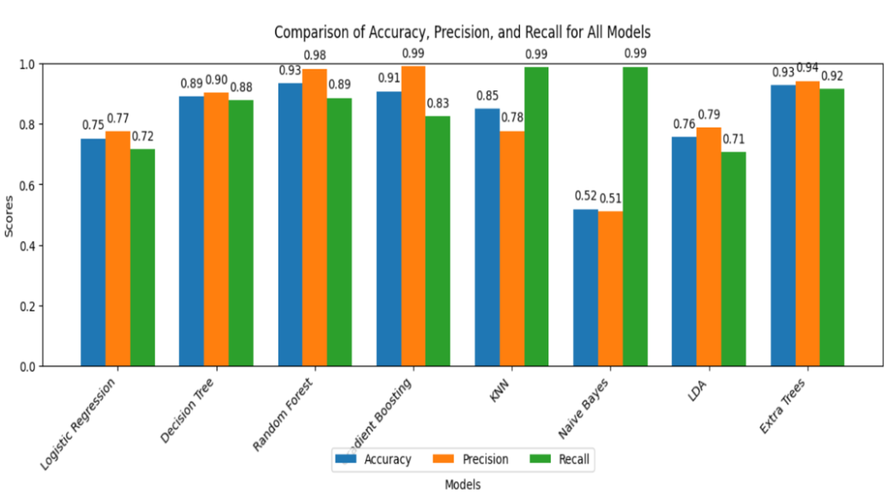

# README

## Introduction
Our project aims to provide a solution to the problem of predicting hospital readmissions which can be ideal for a high-dimensional dataset having class imbalances and mixed data types, resembling how an actual dataset from a hospital would look like. Once our model achieves good accuracy after handling feature spaces using dimensionality reduction on this mixed set of data, a good solution should also explain what exact features led to the results.

Thus, the ideal predictive model for hospital readmissions must combine accuracy, robustness, and interpretability, addressing the underlying complexities of the data while providing actionable insights. When we integrate these advanced machine learning methodologies with explainability frameworks, such a model can enable healthcare providers to reduce readmission rates, optimize resource allocation, and improve patient outcomes.

---

## Methodology
We implemented the following models:
- Logistic Regression
- Decision Tree
- Random Forest
- Gradient Boosting
- K-Nearest Neighbors (KNN)
- Naive Bayes
- Extra Tree
- Linear Discriminant Analysis (LDA)

---

## Novel Methodology
The proposed project employs a three-step methodology combining an autoencoder for dimensionality reduction, XGBoost for classification to predict hospital readmissions in diabetic patients, and SHAP and LIME to ensure interpretation and trustworthiness of the predictive model in the context of healthcare.

Considering that the dataset has many features (50+), dimensionality reduction helps in reducing the risk of the "curse of dimensionality." We choose Autoencoders for dimensionality reduction over other methods like PCA because autoencoders are more flexible with mixed data types like interactions between diagnoses and medications. XGBoost is ideal for handling mixed features, providing interpretable feature importance, and addressing class imbalance with `scale_pos_weight`. It combines efficiency, regularization, and robustness, outperforming alternatives like Random Forests and Neural Networks on structured tabular datasets of this size.

#### Autoencoder
The autoencoder is designed to compress the dataset by encoding input features into a latent space while retaining essential information. It is trained using Mean Squared Error (MSE) as the loss function and the Adam optimizer. 

#### XGBoost
The encoded features is then being utilized as inputs to an XGBoost classifier. Hyperparameter tuning is performed to optimize model performance, and metrics such as Accuracy, Precision, Recall, F1-Score are calculated for evaluation. To address potential class imbalances, techniques like SMOTE and `scale_pos_weight` is applied. This methodology is expected to enable efficient feature extraction and robust predictive performance.

#### Explainability
Moreover, we extend this methodology to integrate SHAP (SHapley Additive exPlanations) and LIME (Local Interpretable Model-Agnostic Explanations) to ensure interpretation and trustworthiness of the predictive model in the context of healthcare. These methods are critical in healthcare applications, where understanding the rationale behind predictions is as important as accuracy to build trust among clinicians and stakeholders. For instance, identifying how features like `time_in_hospital` or `number_diagnoses` influence predictions will ensure actionable and ethical decision-making.

- **SHAP**: SHAP values are used to quantify and visualize the impact of individual features on specific predictions, providing a global and local understanding of the model's behavior.
- **LIME**: LIME will explain how each feature contributes to individual predictions by approximating the model locally with simpler interpretable models.

## Model Performance
Below is a graph comparing the accuracy, precision, and recall of all the methods:

---

## Steps to Implement the Code
1. The original dataset is in `diabetes_data.csv`.
2. Run each cell in the notebook `Data_Cleaning.ipynb`, which will create a new file: `cleaned_diabetes_data.csv`.
3. Use `cleaned_diabetes_data.csv` for feature engineering in by running `Feature_Engineering.ipynb`, which creates a new file: `cleaned_data_2.csv`.
4. Use `cleaned_data_2.csv` for training traditional models and novel models.
5. Run `Model_Traditional.ipynb` for traditional model outcomes.
6. Run `Novel_model_baseline.ipynb` for getting the baseline for the novel model.
7. Run `Novel_model.ipynb` for getting the outcomes of the novel model.
